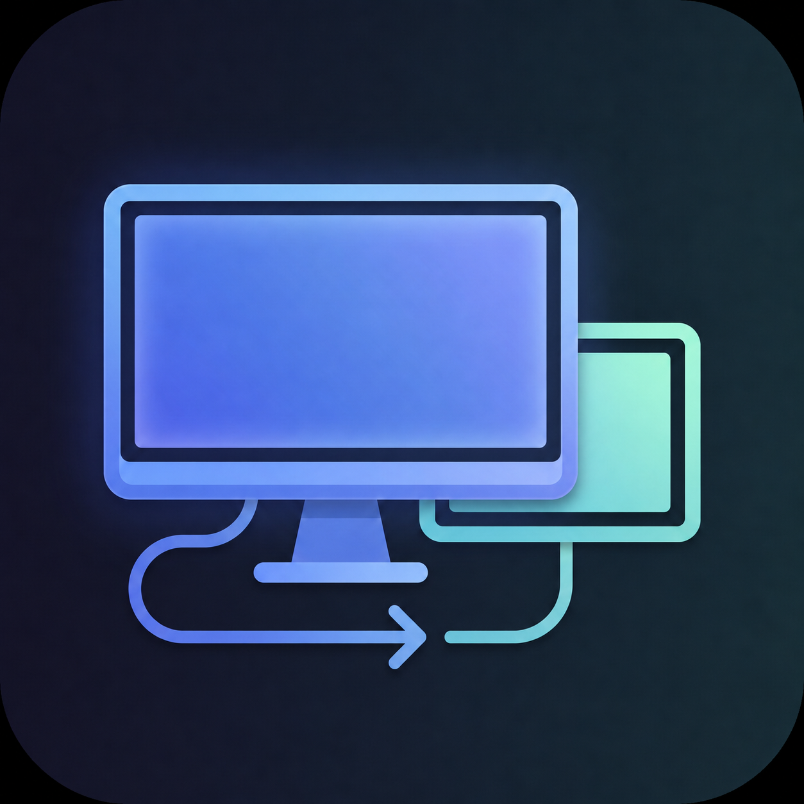

  

<h1 align="center">ScreenBridge Downloads</h1>

  <strong>Turn an Android device into a Windows external display over USB or local Wi-Fi.</strong>

ScreenBridge creates independent Windows virtual displays, streams them to
Android over USB or the local network, and returns Android touch input to
Windows.

## Download

Open the [Releases](../../releases) page and download the newest
`ScreenBridge-<version>-win-x64-setup.exe`.

The self-contained installer adds the Windows application, ScreenBridge IddCx
display driver, Android receiver, USB transport tools, uninstaller, Start menu
shortcut, and optional desktop shortcut. It does not require a separately
installed .NET runtime.

## Version 0.5.3

- Adds a persistent H.264 or HEVC codec selection for every virtual display.
- Uses hardware encoding through NVIDIA NVENC, Intel oneVPL, or a supported
  Media Foundation encoder and validates Android hardware-decoder support.
- Separates desktop capture and encoding with a bounded shared GPU texture
  pool so slow frames do not create a stale-frame backlog.
- Treats the selected Wi-Fi bitrate as the complete transport budget and
  dynamically gives the encoder the capacity left after packet headers and
  active Reed-Solomon recovery.
- Adapts recovery overhead from receiver loss, queue, and jitter feedback
  without restarting capture or the hardware encoder.
- Uses high-resolution UDP pacing and enables Windows media-streaming mode on
  connected Wi-Fi interfaces for more stable local-network delivery.
- Retains direct USB transport, authenticated Wi-Fi pairing and updating,
  touch input, independent displays, and persistent per-display settings.

The selected FPS is a maximum update rate. A static desktop can report a lower
frame rate because no duplicate frames are generated.

## Requirements

- Windows 11 x64
- Android 11 or later
- A GPU with hardware H.264 encoding support; HEVC requires compatible
  hardware on both Windows and Android
- A data-capable USB connection with Android USB debugging enabled, or both
  endpoints on the same local IPv4 network
- Administrator access for display driver installation

Local Wi-Fi streaming does not use internet bandwidth. A low-contention
5 GHz or 6 GHz connection is recommended.

The current `0.x` line is an alpha release. The setup executable is not yet
Authenticode-signed, the virtual display driver uses a development test
certificate, and the bundled Android receiver uses the stable ScreenBridge
release signature.

Source code and technical documentation are available in the
[ScreenBridge repository](https://github.com/danielChinPai/ScreenBridge).
